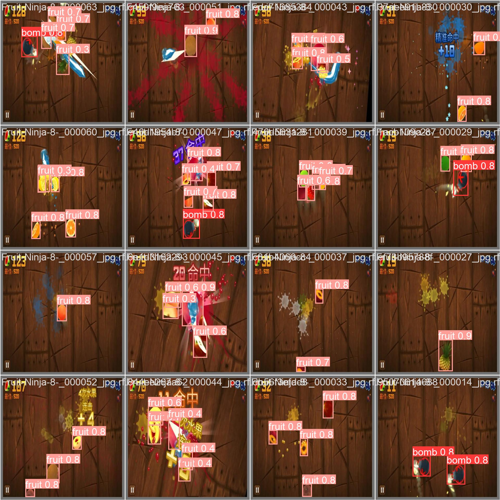

# FruitNinja

## Description

The finality of this project is to run a python code that will play Fruit Ninja by itself.

The method to achieve this is by using YOLOv8, and training it on a custom dataset of fruits and bombs of the game.

------------------------

## Training the model

We will be using a merge of two datasets of fruits and bombs from roboflow, credits are in .txt files in the dataset folder.

We use the file 'train.ipynb' to train the model, and the model 'best.pt' is saved in the 'runs/detect/train*/weights' folder.
 - Current model is file 'runs/detect/train232/weights/best3.pt'.

The following image shows a batch of predictions from the model 'best3.pt':

We can see that the conf parameter will have to be set at a high value to avoid the unnecessary predictions on cut fruits.

------------------------

